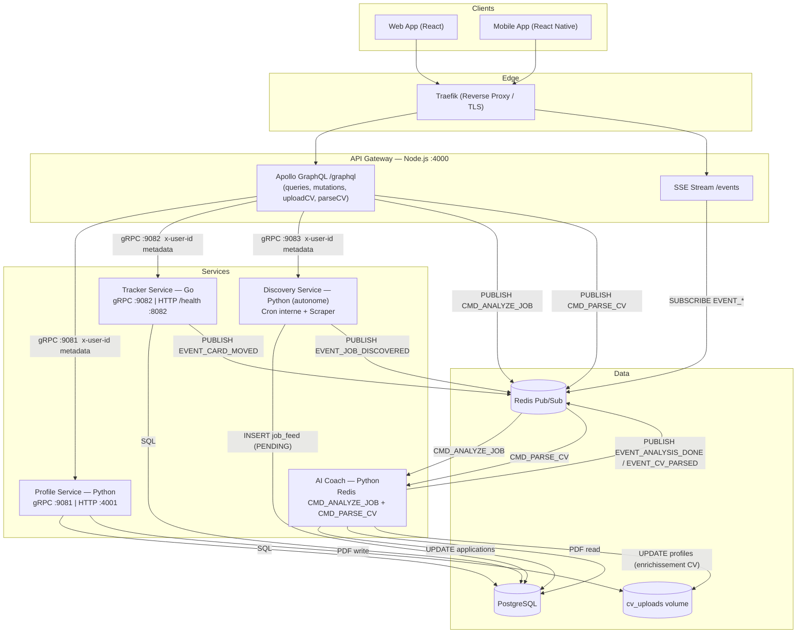

# 🏗️ Architecture Technique - JobMate

Ce document détaille l'architecture logicielle de JobMate. Le système est conçu autour du paradigme de l'entonnoir (Acquisition ➡️ Tri ➡️ Enrichissement ➡️ Action) et utilise une approche orientée microservices (orchestrés de manière pragmatique sur un serveur unique pour le MVP) afin de garantir la scalabilité, la résilience et la séparation des responsabilités.

---

## 1. Vision Globale du Système

JobMate n'est pas une simple application CRUD. C'est un moteur de traitement de données asynchrone conçu pour minimiser les coûts d'appels aux LLMs (Intelligence Artificielle) en filtrant agressivement les données non pertinentes en amont.

1. **Acquisition :** Automatique (via des workers de scraping) ou Manuelle.
2. **Tri (Inbox) :** Zone tampon (`JobFeed`). L'utilisateur approuve ou rejette les offres (action à très faible coût de calcul).
3. **Enrichissement (AI) :** Le traitement coûteux (LLM, RAG) n'est déclenché *que* sur les offres approuvées.
4. **Action (Suivi) :** Le CRM Kanban permettant le suivi des candidatures.

### Diagramme d'Architecture

---

## 2. Stack Technologique

Le choix des technologies est dicté par le principe du "Right tool for the right job" (Le bon outil pour le bon usage), tout en conservant une empreinte mémoire maîtrisée.

| Composant | Technologie | Justification |
| :--- | :--- | :--- |
| **API Gateway / BFF** | Node.js (Apollo Server) | Point d'entrée GraphQL flexible. Excellente gestion de l'I/O asynchrone. |
| **Notifications Temps Réel**| Server-Sent Events (SSE) | Remplaçant léger des WebSockets pour du flux descendant (Server-to-Client). |
| **Profile & CV Service** | Python (FastAPI + asyncpg + pdfminer) | Gestion du profil étendu (skills, expériences, certifications) et stockage des CVs PDF. |
| **Workers d'Acquisition** | Python (httpx + BeautifulSoup + APScheduler) | Scraping asynchrone des job boards, filtrage red flags, scheduleur intégré. |
| **Suivi Candidatures** | Go (Tracker Service) | Performances brutes et faible RAM pour le CRM Kanban (machine à états). |
| **Parsing CV & Analyse IA** | Python (pdfminer.six + OpenRouter LLM) | Extraction structurée du CV (pdfminer, sans binaire natif) + enrichissement LLM. |
| **Communication Interne** | gRPC (Gateway → Profile :9081, Tracker :9082, Discovery :9083) & Redis Pub/Sub (Gateway → AI Coach) | Zéro REST interne depuis la Gateway. Redis Pub/Sub pour le découplage asynchrone vers l'AI Coach. |
| **Base de Données** | PostgreSQL | Robustesse relationnelle pour le CRM et les données utilisateurs. |

---

## 3. Architecture des Microservices

Bien que déployés sur un VPS unique (Monolithe Modulaire / Docker Compose), les services sont logiquement isolés.

### A. API Gateway (Node.js)
* **Rôle :** Unique point d'entrée exposé à l'extérieur (Frontends Web & Mobile). Toutes les communications Gateway → Services internes sont **exclusivement gRPC** (zéro REST interne).
* **Endpoints HTTP/GraphQL exposés (via Traefik) :**
  * `POST /graphql` (Apollo GraphQL) : Toutes les mutations et requêtes de données (Login, Update Profile, ApproveJob, MoveCard, SearchConfig, Kanban, **uploadCV**).
  * `GET /events` (SSE) : Connexion longue durée pour les notifications temps réel (ex: "Analyse IA terminée").
* **Clients gRPC internes (réseau Docker) :**
  * `userGrpc.js` → `profile-service:9081` — Gère SearchConfigs et upload CV.
  * `trackerGrpc.js` → `tracker-service:9082` — Gère le Kanban des candidatures.
  * `discoveryGrpc.js` → `discovery-service:9083` — Gère le job feed et les statuts (SetJobStatus, AddJobByUrl, AddJobManually).

### B. Profile Service (Python)
* **Rôle :** Gère l'identité (register/login), les préférences de recherche (`SearchConfig`) et le profil étendu (skills, expérience, éducation, certifications, CV).
* **Architecture duale (deux serveurs dans le même process) :**
  * **gRPC sur le port 9081** (réseau Docker interne) — Point d'entrée principal pour la Gateway. Contrat défini dans `proto/user.proto`.
  * **HTTP sur le port 4001** — Conservé pour `/health` (Traefik).
* **RPCs gRPC exposés :**
  * `GetProfile` — Retourne le profil complet de l'utilisateur.
  * `UpdateProfile` — Mise à jour partielle (skills, expérience, éducation, certifications, projets).
  * `GetSearchConfigs` — Liste les configs de recherche actives.
  * `CreateSearchConfig` — Crée une nouvelle config.
  * `UpdateSearchConfig` — Mise à jour partielle.
  * `DeleteSearchConfig` — Désactive une config (`is_active = false`).
  * `UploadCV` — Reçoit le buffer PDF, le persiste sur le volume partagé `cv_uploads` et met à jour `profiles.cv_url`. Publie ensuite `CMD_PARSE_CV` sur Redis.
  * `ParseCV` — Publie `CMD_PARSE_CV` sur Redis pour déclencher l'enrichissement AI.
* **Authentification :** L'identité de l'utilisateur est transmise via le champ `x-user-id` des métadonnées gRPC (positionné par la Gateway après vérification du JWT).

### C. Discovery Service (Le Chasseur / Python)
* **Rôle :** Moteur d'acquisition asynchrone entièrement autonome.
* **Important :** Ce service est **indépendant** — il peut recevoir des requêtes synchrones de la Gateway (ex: `GetJobFeed`, `SetJobStatus`, `AddJobByUrl`, `AddJobManually`) mais tourne principalement en tâche de fond.
* **Comportement :**
  * S'exécute via un Job Scheduler interne (APScheduler).
  * Récupère les `SearchConfig` actives en base.
  * Scrape les job boards cibles de manière asynchrone (httpx + BeautifulSoup).
  * **Filtre "Red Flag" :** Applique une exclusion stricte en amont.
  * Insère les offres validées dans `job_feed` (statut: `PENDING`) avec `title`, `description`, `source_url`, `raw_data`.
  * Expose un serveur **gRPC sur le port 9083** pour les appels synchrones de la Gateway.
* **RPCs gRPC exposés :**
  * `GetJobFeed` — Liste les offres de l'utilisateur avec filtre `status` optionnel.
  * `SetJobStatus` — Approuve ou rejette une offre (`APPROVED` | `REJECTED`).
  * `AddJobByUrl` — Scrape une URL spécifique et l'insère en `PENDING`. Publie `EVENT_JOB_DISCOVERED`.
  * `AddJobManually` — Insère une offre via formulaire (nom entreprise, lieu, profil recherché, type de contrat, date de début). Publie `EVENT_JOB_DISCOVERED`.

### D. AI Coach Service (Le Cerveau / Python)
* **Rôle :** Analyse sémantique et génération de contenu assistée par LLM.
* **Triggers (multi-canal Redis) :**
  * `CMD_ANALYZE_JOB` — Déclenché par la Gateway quand un utilisateur approuve une offre.
  * `CMD_PARSE_CV` — Déclenché par la Gateway / Profile Service quand un CV est uploadé.
* **Actions (CMD_ANALYZE_JOB) :**
  * Calcule le `MatchScore`.
  * Génère les listes `Pros` (Points forts) et `Cons` (Points d'attention).
  * Rédige la lettre de motivation et le contenu de CV optimisé ATS.
  * Publie `EVENT_ANALYSIS_DONE` sur Redis → SSE vers le client.
* **Actions (CMD_PARSE_CV) :**
  * Lit le PDF depuis le volume partagé `cv_uploads` via `pdfminer.six`.
  * Appelle le LLM pour extraire : `skills`, `experience`, `education`, `certifications`, `projects`.
  * Met à jour la table `profiles` avec les données structurées (PATCH partiel : ne remplace que les champs non vides).
  * Publie `EVENT_CV_PARSED` sur Redis → SSE vers le client.

### E. Tracker Service (Le CRM Kanban / Go)
* **Rôle :** Gère le cycle de vie de la candidature post-approbation.
* **Transport :** Expose un serveur **gRPC sur le port 9082** (réseau Docker interne uniquement). Un serveur HTTP minimal sur le port 8082 est conservé exclusivement pour l'endpoint `/health` requis par Traefik.
* **Contrat gRPC :** Défini dans `proto/tracker.proto` (partagé à la racine du dépôt). Les stubs Go générés (`internal/pb/`) sont versionnés avec le code source et validés en CI par `protoc`.
* **RPCs exposés :** `ListApplications`, `MoveCard`, `AddNote`, `RateApplication`.
* **Actions :** Gère les transitions d'état (To Apply ➡️ Applied ➡️ Interview ➡️ Hired) et prépare l'archivage de la recherche en cas de succès.

---

## 4. Schéma de Données (PostgreSQL)

La base de données relationnelle garantit l'intégrité du suivi candidat.

### Entités Principales :

* **`Users`** : `id`, `email`, `password_hash`.
* **`Profiles`** : `user_id`, `full_name`, `status`, `skills_json`, `experience_json`, `projects_json`, `education_json`.
* **`SearchConfig`** (La "Recherche Enregistrée") :
  * `id`, `user_id`, `keywords` (Array), `red_flags` (Array)
  * `target_salary`, `remote_policy`, `location`, `cl_template_text` (Template Lettre de motivation).
* **`JobFeed`** (La "Waiting List" / Inbox) :
  * `id`, `user_id` (propriétaire direct pour les offres manuelles), `search_config_id` (nullable), `raw_data` (JSON), `source_url`.
  * `title` (VARCHAR 512) et `description` (TEXT) : colonnes dénormalisées depuis `raw_data` pour les requêtes SQL (tri, filtrage, recherche), évite l'extraction JSONB systématique.
  * `status`: `PENDING` | `APPROVED` | `REJECTED`. *(Note: Cette table possède un TTL pour nettoyage automatique).*
  * `is_manual`: `TRUE` si l'offre a été ajoutée via URL ou formulaire manuel par l'utilisateur (et non scrapée automatiquement).
  * Colonnes spécifiques aux offres manuelles : `company_name`, `company_description`, `why_us`.
* **`Profiles`** (suite) :
  * `skills_json`, `experience_json`, `education_json`, `certifications_json`, `projects_json` (JSONB).
  * `cv_url` — chemin relatif du CV PDF sur le volume partagé `cv_uploads`.
* **`Applications`** (Les candidatures actives) :
  * `id`, `user_id`, `job_feed_id`
  * `current_status` (Enum: `TO_APPLY`, `APPLIED`, `INTERVIEW`, `OFFER`, `REJECTED`, `HIRED`).
  * `ai_analysis` (JSON: Score, Pros, Cons, Suggested_CV_Content).
  * `generated_cover_letter` (Text).
  * `user_notes` (Text), `user_rating` (Int).
  * `relance_at` (Timestamp) — date de relance planifiée.
  * `history_log` (JSON: Audit trail des changements de statut).

---

## 5. Le Flow de Communication (Exemple Asynchrone)

Voici comment les services interagissent lors de l'action clé du système : **L'approbation d'une offre**.

1. **User** clique sur "Approuver" dans le frontend.
2. **Frontend** envoie une mutation GraphQL `approveJob(id)` à l'**API Gateway**.
3. **API Gateway** met à jour Postgres (`JobFeed.status = APPROVED` et crée l'entrée `Applications`).
4. **API Gateway** publie le message asynchrone `CMD_ANALYZE_JOB` avec l'ID de la candidature sur **Redis Pub/Sub**.
5. L'**API Gateway** répond immédiatement au client (HTTP 200). Le frontend affiche un état "En cours d'analyse...".
6. Le **AI Coach Service (Python)** capte le message Redis, effectue son traitement lourd (appels LLM), met à jour la table `applications` dans Postgres, puis publie l'événement `EVENT_ANALYSIS_DONE` sur Redis.
7. L'**API Gateway** capte l'événement de fin via Redis et pousse la notification au Frontend via le canal **SSE** ouvert.
8. Le **Frontend** met à jour la carte instantanément avec les résultats de l'IA.

**Flux parallèle — Enrichissement CV (CMD_PARSE_CV) :**

1. **User** uploade un PDF via la mutation `uploadCV`.
2. **Profile Service** persiste le fichier sur le volume `cv_uploads`, met à jour `profiles.cv_url`, publie `CMD_PARSE_CV {userId, cvUrl}` sur Redis.
3. L'**API Gateway** répond immédiatement (URL du CV).
4. L'**AI Coach** reçoit `CMD_PARSE_CV`, extrait le texte via `pdfminer.six`, appelle le LLM, enrichit la table `profiles`.
5. L'**AI Coach** publie `EVENT_CV_PARSED` → Gateway SSE → client.
